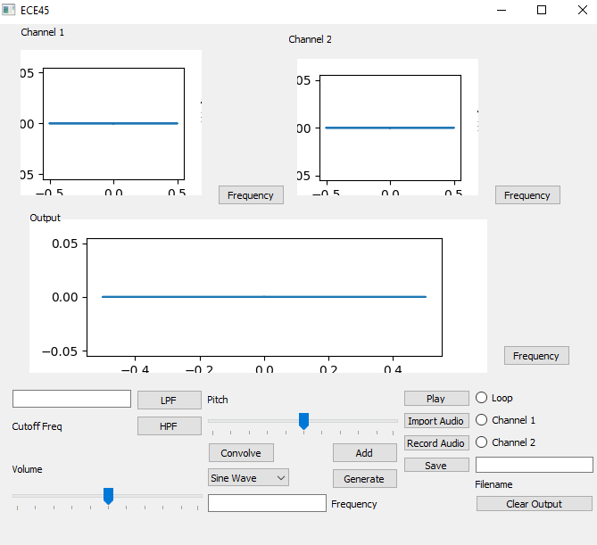
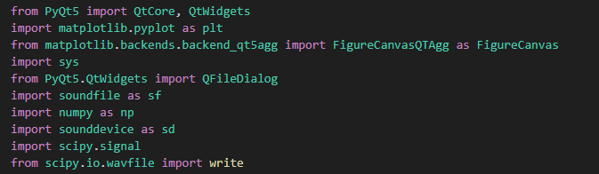
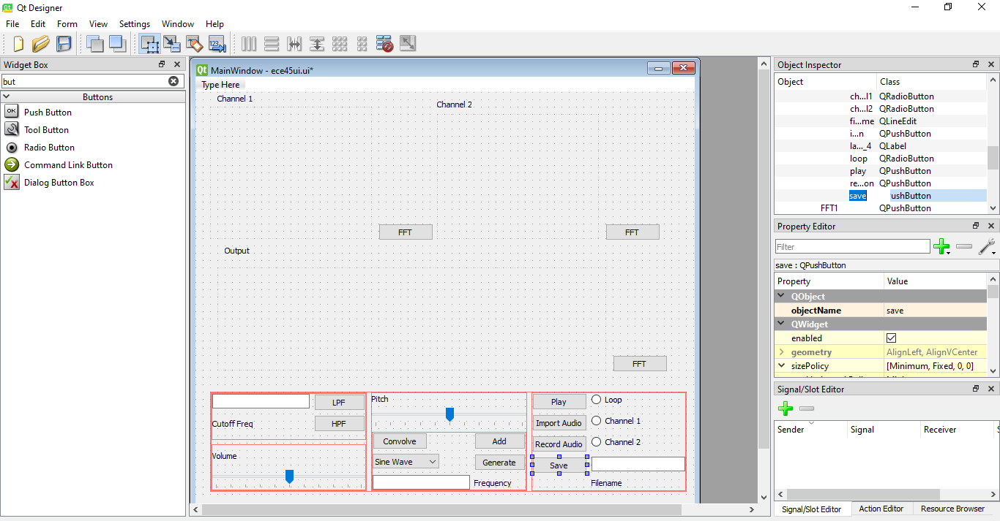

# ECE45 - Final Project Alex L




This synthesizer can generate and record waveforms using the computer's microphone. This makes it easy to modify, filter, and change signals that one records themselves. Designed in qt designer, with functionality added manually, this GUI assists the user in easily modifying and editing their sounds. It uses matplotlib in order to plot the waveforms in either the frequency or time domain. Various features such as looping, importing, recording, and saving all assist in making it easier to create .wav files.

There are a few options to choose from when generating a waveform. A two-channel interface lets the user combine generated waveforms and visualize them before they add it to their output. The user can select the frequency the generated waveforms have. In addition, a convolution button has been added that allows users to convolve waveforms with one another. If at any moment the user wants to restart, they can clear the output using the 'clear output' button. Dynamic zoom has been added to the output as well.

**To see a detailed demonstration of how the project works, check out the video down below**
https://drive.google.com/file/d/12h5dadfCiaJ_CajQov-vECa9uSteeaE5/view?usp=sharing 

## Citations and how to use


Above are the imports used to write this code.

- Scipy was used to generate signals, and import files
- soundfile and sounddevice was used to record and playback .wav files
- numpy was used to assist in array creation of files, and also do some signal processing (along with scipy)
- pyqt5, sys, and its associated imports implemented GUI functionality
- matplotlib assisted in adding the plot widgets, and actually plotting the signals.

In addition, a skeleton GUI was made using pyqt designer.



Functionality was then added manually through the python code. I've attached the .ui file to the zip so you can see what it looks like!

If for some reason your audio devices aren't working, use 

```
        devices = sd.query_devices()    # get list of devices
        print(devices)
        sd.default.device = 2           # set default device to microphone device. Will have to change to record
```

In addition to the above, modify the 'device=4' line to your device output ID!

```
sd.play(audio, self.freq, device=4, loop=self.loop.isChecked())
```
